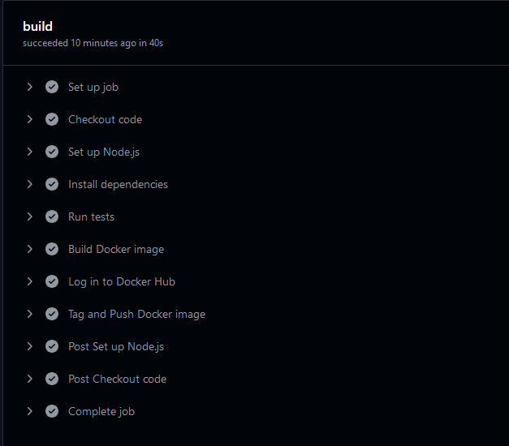
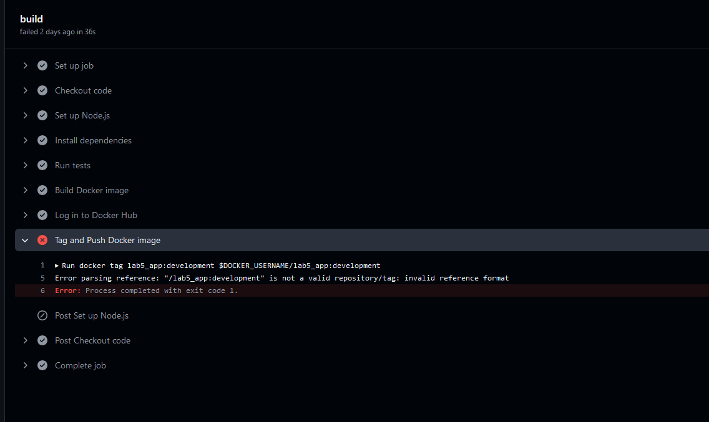

# Lab 5
Members of this Group: `Maximilian Bleier`, `Nikola Radulovic`, `Raphael Unger` and `Alexander Prix`

This lab includes the creation of an Azure Web App for Containers for a developoment and production environment. A Node.js application is build as a Docker image and deployed to the Docker Registry, from which the Azure Web Apps pull and deploy this image.

This repository includes the creation of an `Azure Web App` using a `development` and `production` environment. Therefore, 
a `Node.js` application is built as a Docker image and deployed to the Docker Registry, from which the Azure Web Apps pull and deploy this image.

## How to deploy
1. Make changes (duh)
2. Push the changes to the main branch. Those changes should be visible on the Development Link of this project.
3. Push the changes from main to release branch
4. After waiting for the appropriate Github Action to finish, changes should be visible on the Production Site.

## Links
### Docker
This link leads to the Docker image inside the Registry :
- [lab5_app](https://hub.docker.com/repository/docker/raphaelunger/lab5_app/tags)

### Azure Web Apps
- [Development](https://lab5-dev-ayg3c8f0cvetgebw.canadacentral-01.azurewebsites.net/)
- [Production](https://lab5-prod-adfnerh3augngegm.canadacentral-01.azurewebsites.net/)

### Routes
You can send a string to `/checksum` in order to generate the corresponding checksum for it. 

#### Example Data
``` JSON
{
    'input': 'HelloWorld'
}
```
results in
`1a2fa200`

## Github Actions
### Finished pipeline


### Release workflow
